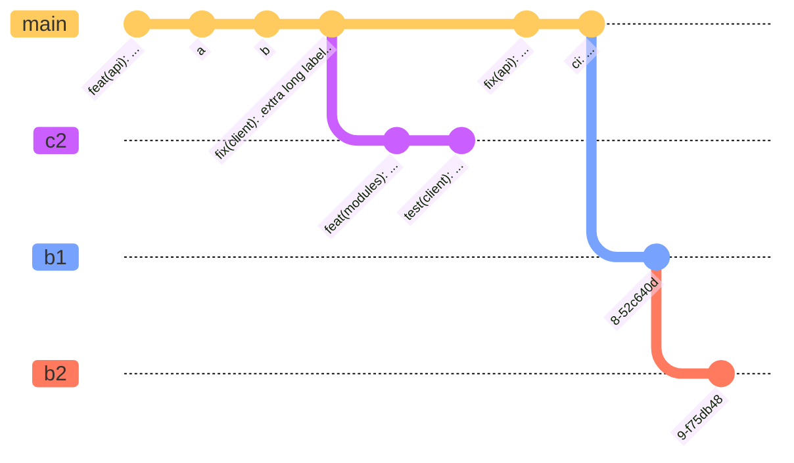

Mermaid.js est une bibliothèque open-source JavaScript qui permet de générer des diagrammes et des graphiques à partir de textes simples. En l'utilisant directement avec Docusaurus, cela permet de mettre au même endroit tous mes schémas as code, et donc de ne pas avoir à gérer différents outils pour générer mes images ou à importer des images stockées ailleurs.

Plus d'exemples dans la [documentation de Mermaid](https://mermaid.js.org/intro/).  
Quelques types de graphiques intéressants :
* Gitgraph Diagrams 
* Flowcharts
* Pie charts
* Timelines

Un exemple de GitGraph : 



Pour générer des graphs en live : https://mermaid.live 

### Installer et utiliser le plugin Mermaid pour Docusaurus

Commencer par importer le plugin `@docusaurus/theme-mermaid`

```
npm install --save @docusaurus/theme-mermaid
```
Dans le fichier `/docusaurus.config.js` activer le mode Mermaid : 

```
module.exports = {
  markdown: {
    mermaid: true,
  },
  themes: ['@docusaurus/theme-mermaid'],
};
```


Puis dans une page ajouter les balises Mermaid, et mettre le code de votre graphique. Ici pour l'image en début d'article.

```jsx title=""
    ```mermaid
        %%{init: { 'logLevel': 'debug', 'theme': 'base', 'gitGraph': {'rotateCommitLabel': true}} }%%
        gitGraph
          commit id: "feat(api): ..."
          commit id: "a"
          commit id: "b"
          commit id: "fix(client): .extra long label.."
          branch c2
          commit id: "feat(modules): ..."
          commit id: "test(client): ..."
          checkout main
          commit id: "fix(api): ..."
          commit id: "ci: ..."
          branch b1
          commit
          branch b2
          commit
    ```
```