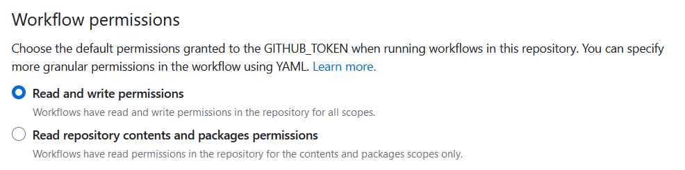
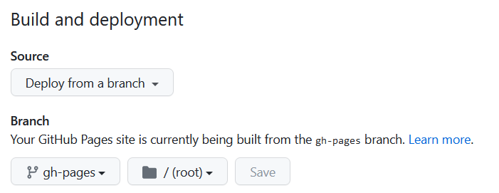

En parallèle du [déploiement de sites sur GitLab](2023-05-13-Docusaurus_gitlab.md), je teste aussi la création d'un blog et d'une page de profil sur GitHub Pages.  
La documentation de Docusaurus contient des exemples pour Netlify, Vercel ou GitHub Pages, à retrouver ici : https://docusaurus.io/docs/deployment, mais j'ai tout de même eu besoin de faire quelques ajustements.
  
Je vais donc détailler un petit peu les actions nécessaires pour un déploiement sur GitHub Pages de votre site Docusaurus.

<!--truncate-->

### Configuration coté Docusaurus
Très peu de modifications sont nécessaires, et elles sont bien décrites dans la documentation de Docusaurus.
De mon coté j'ai suivi le tuto pour faire un déploiement avec les GitHub Actions :  https://docusaurus.io/docs/deployment#triggering-deployment-with-github-actions 

### Gestion du pipeline GitHub
Voici un exemple de création de pipeline simpliste `.github\workflows\publish.yml`.  
Ici notre pipeline ne fait qu'un build du projet et dépose le résultat dans la branche **gh-pages**.  
On peut imaginer facilement mettre en oeuvre des workflows de validation des articles et contenus, et de ne publier que lors d'un tag ou d'une action manuelle.

```yml
name: Deploy to GitHub Pages

on:
  push:
    branches:
      - main

jobs:
  deploy:
    name: Deploy to GitHub Pages
    runs-on: ubuntu-latest
    steps:
      - uses: actions/checkout@v3
      - uses: actions/setup-node@v3
        with:
          node-version: 16

      - name: Install dependencies
        run: npm install
      - name: Build website
        run: npm run build

      # Popular action to deploy to GitHub Pages:
      # Docs: https://github.com/peaceiris/actions-gh-pages#%EF%B8%8F-docusaurus
      - name: Deploy to GitHub Pages
        uses: peaceiris/actions-gh-pages@v3
        with:
          github_token: ${{ secrets.GITHUB_TOKEN }}
          # Build output to publish to the `gh-pages` branch:
          publish_dir: ./build
```

:::info
En suivant la documentation et en utilisant l'Action `peaceiris/actions-gh-pages@v3`, quelques ajustements ont été nécessaires 
* node-version: 16 au lieu de 18
* passage à npm install et npm run au lieu de Yarn (pour être cohérent ave cmon usage en local)
* j'ai du ajouter les droits Read & Write sur mon repo **/settings/actions > General**

* création de la branche **gh-pages** car c'est sur celle ci que l'Action fait le déploiement
* modification de la branche source des déploiements de Pages sur mon repo **/settings/pages**

:::
